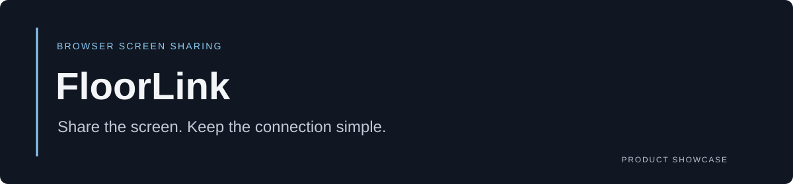
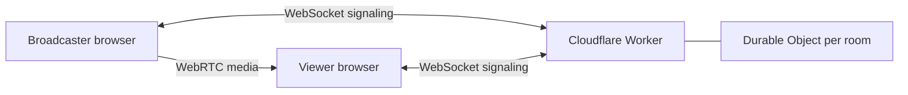

# FloorLink

**Share the screen. Keep the connection simple.**

FloorLink is an internal browser application for sharing a PC's screen and supported audio with viewers elsewhere in an office. A room link connects the participants; WebRTC carries the media.

[Watch the product tour](https://deadwayz.github.io/floorlink-showcase/) · [Explore the preview](#preview) · [Architecture](#architecture)

## Why it exists

Sometimes an office needs a live display on another floor without a meeting platform, recording workflow, or streaming server. FloorLink focuses on that narrow job: choose a screen, start broadcasting, and open the viewer in a browser.

## Preview

The public tour is an illustrative animation. It does not capture your screen, create a live room, or request application credentials. The working application and its source remain private.

## What the application does

- Create rooms and share viewer links.
- Capture a screen, window, or browser tab through the native sharing picker.
- Stream video and supported audio through browser peer connections.
- Protect app access with a shared code and optional room PINs.
- Keep a separate room token for the broadcaster role.
- Recover from signaling and peer-connection failures.
- Inspect connection state, latency, bitrate, and packet-loss diagnostics.
- Offer fullscreen, mute, and volume controls for viewers.

## Architecture

The Worker relays connection metadata; it does not handle screen or audio media. Direct connections send media peer-to-peer. An optional TURN relay can carry media when direct connectivity is unavailable, but this repository does not provision one.

## Engineering notes

- **Separate control and media paths.** Signaling can recover independently from a running media connection.
- **Room-scoped state.** Durable Objects coordinate participants and relay negotiation messages.
- **Diagnostics over guesswork.** Connection evidence helps distinguish browser, signaling, and network failures.
- **Honest capture boundaries.** Audio support depends on the browser, operating system, and chosen capture surface.

**Application stack:** React · TypeScript · Vite · Tailwind CSS · WebRTC · Cloudflare Workers · Durable Objects

## Project scope

FloorLink is designed for a small internal audience. Firewall/VLAN reachability and real two-PC testing remain deployment acceptance concerns. Shared-code access is not a multi-user identity system, and large audiences would need a different media architecture.

## More projects

[LYNX — network monitoring](https://github.com/deadwayz/lynx-monitoring-showcase) · [HYLE — IT asset management](https://github.com/deadwayz/hyle-showcase) · [Creator's GitHub profile](https://github.com/deadwayz)

## Usage and permissions

See [NOTICE.md](NOTICE.md). This showcase does not distribute the application source or grant an open-source license for it.
